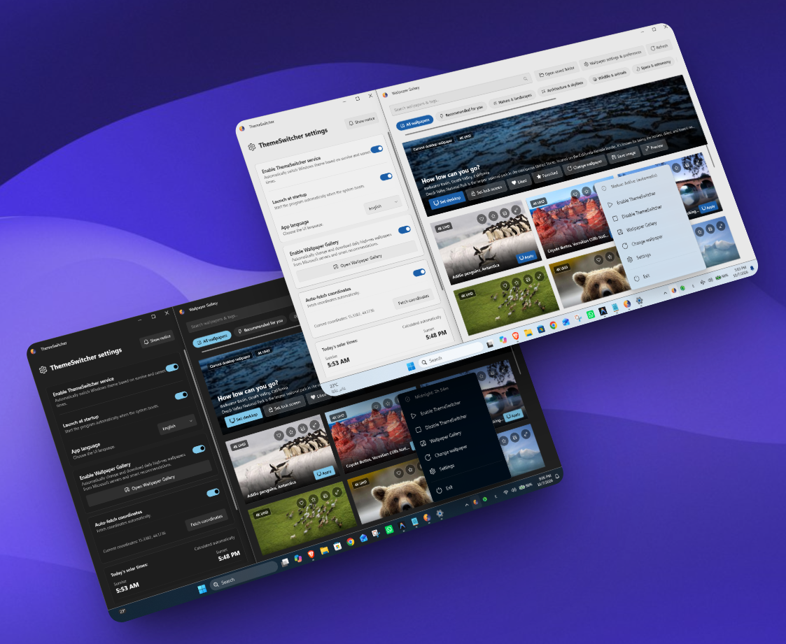

# ThemeSwitcher


### 🌓 أداة حديثة وفائقة الخفة لجدولة الوضع الداكن ومعرض خلفيات بدقة 4K لنظامي Windows 10/11

🌐 [النسخة الإنجليزية](README.md)

أداة ويندوز فائقة السرعة وجاهزة للتشغيل مباشرة دون متطلبات مسبقة (Self-Contained)، تقوم بتبديل ثيم النظام بسلاسة بين الوضعين الفاتح (Light) والداكن (Dark) بناءً على أوقات الشروق والغروب المحلية الدقيقة.

تم تصميم ThemeSwitcher لتقديم أعلى مستويات الأداء والأناقة البصرية، حيث يتكامل بعمق مع نظام التشغيل ويندوز ليوفر تجربة تماثل أدوات النظام الأساسية وبدون أي ثقل أو استهلاك زائد للموارد.

---

<p align="center">
  
</p>

## 🚀 الميزات الرئيسية
* **🌅 مزامنة شمسية ذكية وأولوية للعمل أوفلاين:** يقوم بحساب أوقات الشروق والغروب المحلية بدقة متناهية؛ حيث يُزامن البيانات الشمسية مرة واحدة فقط يوميًا، ويعمل بنسبة 100% دون الحاجة إلى إنترنت عبر كاش محلي مشفر وسريع التعافي.
* **⚡ محرك التبديل الفوري (FastSwitch):** يبدّل السمة فورًا عند بدء تشغيل النظام، أو الاستيقاظ من وضع السكون، أو فتح قفل الشاشة مع تقليل وميض الشاشة لأدنى حد ممكن لضمان انتقال سلس للغاية، وتطبيق السمة قبل اكتمال تحميل سطح المكتب. كما يقوم بمزامنة فورية وشاملة عبر جميع التطبيقات المفتوحة والمتوافقة في الوقت الفعلي، تمامًا كما تفعل إعدادات ويندوز الرسمية.
* **🖼️ معرض خلفيات بدقّة تصل إلى 4K:** تصفح، وخصص، وطبق خلفيات مذهلة (بدقة 1080p و2K وحتى 4K)، مع تصفح محلي فوري (0ms) وتزامن ذري وسلس للشاشات المتعددة.
* **🔋 انعدام تام لاستهلاك المعالج (0% CPU على الخمول):** مبني على بنية برمجية تعتمد على الاستماع للأحداث (Event-driven) تخفض استهلاك المعالج إلى 0% تمامًا أثناء خمول التطبيق؛ مما يحافظ على عمر البطارية وموارد الجهاز دون مساس.
* **🛡️ فرض حالة الثيم ومكافحة التلاعب:** يحمي مفاتيح ريجستري الثيم الخاصة بنظامك تلقائيًا، حيث يعيد ضبط أي تعديل أو عبث خارجي غير مصرح به لحظيًا، مع إمكانية تعليق الحماية بمرونة عبر أيقونة شريط المهام (Disable ThemeSwitcher).
* **📦 حزم مدمجة بالكامل (.NET 10):** لا حاجة لتثبيت بيئة دوت نت أو أي برامج تشغيل؛ التطبيق يحمل كافة ملفاته بداخله، فقط حمّل وشغّل فورًا.
* **⚡ واجهة Fluent فائقة الاستجابة وتسريع عتادي (GPU):** قائمة شريط مهام مسبقة المعالجة بتأثيرات حركية مدعومة عتاديًا بالكامل (Mica/Acrylic)، ومتوافقة بسلاسة تامة مع الشاشات ذات معدلات التحديث العالية (120Hz / 144Hz وأعلى).
* **📶 فحص ذكي ومستقر للشبكة:** فحص ثلاثي متقدم لحالة الاتصال يميز بدقة بين مجرد الارتباط بالراوتر والوصول الفعلي للإنترنت، مع جدولة المهام تلقائيًا في الخلفية دون أي تجميد للواجهة.
* **🔄 مدير تحديثات مدمج:** فحص وتنزيل التحديثات الجديدة وتثبيتها بسلاسة من داخل التطبيق مباشرة دون الحاجة لفتح المتصفح.
  
## 📦 التثبيت والتحديث

يمكنك تثبيت ThemeSwitcher أو ترقيته لأحدث إصدار عبر أداة **winget** في Windows Terminal (أو PowerShell):

# التثبيت
```powershell
winget install --id Medoo.ThemeSwitcher
```
# التحديث لآخر إصدار
```powershell
winget upgrade --id Medoo.ThemeSwitcher
```
> 💡 **تُفضّل التثبيت اليدوي؟** حمّل أحدث حزمة تثبيت مستقلة مباشرةً من صفحة [إصدارات GitHub](https://github.com/Medo-bit/ThemeSwitcher/releases/latest).

## 💻 متطلبات النظام
* **نظام التشغيل:** ويندوز 10 (إصدار 2004 أو أحدث) / ويندوز 11
* **المعمارية:** x64
* **الصلاحيات:** مستخدم عادي Standard User (لا يتطلب صلاحيات مسؤول للتشغيل اليومي)
